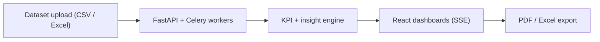

# Business Analytics Dashboard

**Self-hosted analytics dashboard: KPIs, drag-and-drop dashboards, dataset upload, AI insights and PDF/Excel export, with a desktop companion app.**

       

## Problem it solves

Small teams pay for BI tools they barely use, or keep KPIs in spreadsheets. This dashboard runs on their own server, ingests datasets, tracks KPIs live and exports reports.

A comprehensive business intelligence dashboard with FastAPI backend, React/TypeScript frontend, and a Flet desktop companion app. Features real-time analytics, interactive KPI tracking, data filtering, report export, and Docker Compose deployment.

## Features
- Real-time analytics
- Interactive dashboards
- Data export
- Docker deployment
- Flet desktop app

## Tech Stack
Python, FastAPI, React, TypeScript, Docker